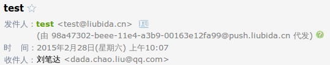

## 1. 用户接入 SendCloud 的大致流程是怎样的?
    
** 免费用户 ( 每日额度: 200 )**

* 注册帐号, 激活邮件 ( 每日额度: +30 )
* 完善信息 ( 每日额度: +30 )
* 创建[发信域名](../guide/base.md#_3) ( 每日额度: +60 )
* 创建[API_USER](../guide/base.md#api_user) ( 每日额度: +40 ) 
* 创建[样本](../guide/base.md#sample), 通过审核 ( 每日额度: +40 ) 

> SendCloud 为用户准备了测试的域名, API_USER, 样本, 你可以直接测试使用.

** 付费用户 ( 每日额度: 6000 )**

* [网站认证](../guide/base/#_7)
* [商业认证](../guide/base/#_7)
* 充值 ( 需先完成前两项 )

** 付费用户 ( 每日额度: > 6000 )**

* 信誉度在 90 分以上
* 联系客服
    
- - -    

## 2. 如何理解 mail from, from, reply-to?

**mail_from:** 信封上的发件人, 由「前缀@域名」组成. 此域名就是所谓的[发信域名](../guide/base.md#_3)
 
**from:** 信件内容里的发件人. 用户可以任意填写, 支持别名显示.

「代发」是否出现, 就是看 *mail_from* 和 *from* 是否相同.

**reply-to:** 信件回复的收件人. 用户直接回复邮件时, *reply-to* 就是默认的收件人. 如果用户不指定它, *from* 就是默认的收件人.

    # 如何写别名
    String from = MimeUtility.encodeText("爱发信客服", "UTF-8", "B") + "<support@ifaxin.com>";

- - -

## 3. 邮件中为什么会显示代发?

邮件中存在 *mail_from* 和 *from* 两个概念, 如果这两者不一致, 则 ESP 会在客户端上显示代发, 用以提醒收件人两者的不同.

显示代发如下图: 



    from = 'test@liubida.cn'
    mail_from = '98a47302-beee-11e4-a3b9-00163e12fa99@push.liubida.cn'

如果两者一致, 则不会显示代发, 如下图: 


当然, 有些 ESP 并不会要求这两者完全一致, 而是只要求两者的域名相同 ( 比如 QQ 邮箱 ) .

由于 SendCloud 对 *mail_from* 的前缀使用的是随机串, 所以, 如果碰到严苛的 ESP ( *mail_from* 和 *from* 必须完全一致才不显示代发, 比如网易邮箱 ), 那也只能爱莫能助了.

如果你对不显示代发有非常强烈的需求, 可以联系SendCloud客服, 帮你再想想办法.

- - -

## 4. 【发送相关-队列状态】中, 有些域的发送被暂停, 显示"域名发信超出额度限制". 是什么原因?

ESP 对于单个域名每天的发信量是有限制的, 这个限制的量我们称之为发信阈值. 当某个域名发信的量到达阈值之后, ESP 就会直接拒信.

这个阈值到底是多少? 我们无从得知, 只知道它是由 ESP 根据此域名的历史发信数据, 用户投诉情况来动态调节的黑盒数据.

基于此种情况, SendCloud 实现了自适应发送策略 (预热发送): 
```
* SendCloud 能够根据 ESP 反馈的信息来判断出当前的发信量是否已经到达了阈值.
* 如果到达阈值, 则此域名下发往此 ESP 的邮件会被暂停, 每隔一段时间重试, 直至邮件发送成功.
* 根据经验, ESP 的阈值在凌晨会被清零. 清零之后, 暂停的邮件队列会自动启动, 继续发送.
* 通过一段时间的预热发送, 此域名的阈值会快速增长, 直至满足用户的日发送需求.
* 您可以一次性投递大量的邮件进入 SendCloud, 然后我们会根据 ESP 反馈信息, 动态实行发送启停, 直至发送完毕.
```

关于阈值, 再多说两句.

ESP 对于域名的阈值是会动态调节的, 如果邮件质量不错, 用户投诉低, 阈值是会快速提升的.

同时, 通过 SendCloud 发出的邮件, 在国内各大 ESP 的阈值的起始值是很高的, 远大于其他产品.

[知乎关于预热的描述](http://zhuanlan.zhihu.com/email/19802487)
- - -

## 5. WebHook 是什么?

**为什么要使用webhook?**
    
一封邮件发送之后, 会产生各种各样的事件和状态.

例如: 被ESP弹回, 或者发送成功了, 用户打开了邮件, 点击了链接, 或者很不幸的,用户退订了你的邮件, 甚至举报了您的邮件. 如果你需要捕获此类事件进行相应的处理, WebHook提供了相应的技术支持. 
    
当某个事件发生时, 就会触发 SendCloud 向客户设置的 URL 用 POST 方式发送数据, 客户收到数据, 解析出事件和数据, 做后续的处理.

**webhook签名认证是什么，是必须的吗?**
    
签名认证是为了进行身份的验证, SendCloud为客户生成了一个APP KEY, 这个APP KEY只有Sencloud和客户知道.
    
SendCloud将这个APP KEY加密隐藏在签名中, 客户收到数据后用同样的算法比对签名, 就可以证实这个消息确实是SendCloud发送的, 从而预防了其他人伪造消息的可能.
签名验证并不是必须的, 但是如果客户对消息的可靠性要求非常高, 建议使用.

**发送的消息未及时接收,消息会丢失吗?**
    
如果你配置了POST URL, SendCloud将进行5次重试。 每次重试的时间间隔最快为1, 2, 4, 8, 16分钟，即在消息丢失前，你将有至少半小时的时间修复问题，如果超过重试次数，SendCloud将消息丢弃。 你将有3秒钟的时间处理每条消息，如果3秒钟之内未向SendCloud返回状态码200，SendCloud将会重发该条消息。    

- - -

## 6. SMTP 方式接入, 如何使用标签功能?

验证 API_USER 时将标签ID ( label_id ) 拼接在后面即可, 拼接规则:

> api_user + '#' + label_id

不使用标签接入:
```
S: 250-SendCloud Inbound Server Hello, Haraka is at your service.
S: 250-PIPELINING
S: 250-8BITMIME
S: 250-SIZE 16000000
S: 250-STARTTLS
S: 250 AUTH LOGIN

C: AUTH LOGIN base64(api_user)
```

使用标签接入:
```
S: 250-SendCloud Inbound Server Hello, Haraka is at your service.
S: 250-PIPELINING
S: 250-8BITMIME
S: 250-SIZE 16000000
S: 250-STARTTLS
S: 250 AUTH LOGIN

C: AUTH LOGIN base64(api_user + '#' + label_id)
```

python 代码片段:
```
# 不使用标签接入:
s = SMTP('%s:%d' % (HOST, PORT))
s.set_debuglevel(DEBUG_MODE)
if USE_SSL:
    s.starttls()
s.login(API_USER, API_KEY)

# 使用标签接入:
s = SMTP('%s:%d' % (HOST, PORT))
s.set_debuglevel(DEBUG_MODE)
if USE_SSL:
    s.starttls()
s.login(API_USER + '#' + label_id, API_KEY)
```


- - -

