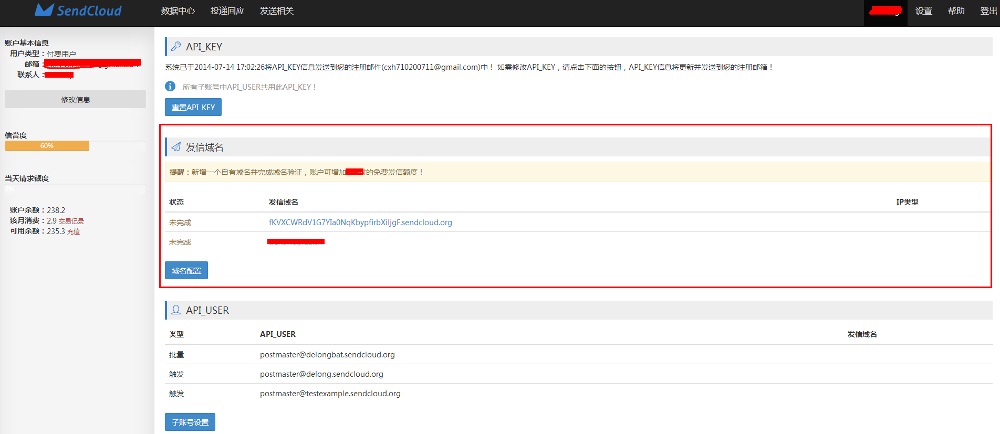

# 引言
邮件是一个岁月悠久的服务, 在这个行业中, 众多前辈们制定了很多的行业标准. 所以, 想要让您的邮件顺利的送达, **遵循游戏规则** 是非常必要的o~.

#### 发信域名
发信域名是一封邮件的出处. 在smtp会话过程中, 即是mail from的后缀

    mail from: test@liubida.com
    250 sender test@liubida.com OK

此时, `liubida.com`就是这封邮件的``发信域名``. 发信域名的概念很重要, 因为很多邮件服务器就是根据发信域名来确定`发信的频度`, `每天发信的数量`等重要指标的.

SendCloud为免费用户生成了`测试使用的发信域名`, 方便用户直接进行测试发送. 
当用户正式接入服务时, 需要创建自己的发信域名.
> 测试域名的命名规则: '随机串.sendcloud.org'

每个账户必须要有一个发信域名

域名代发, 放在高级里面说明, 这里做个跳转

#### 域名配置

* VERIFY_KEY

* SPF

* DKIM

* CNAME

* MX

#### 验证信息

* API_USER

* API_KEY

#### 

## 服务方式
## 发送配置

